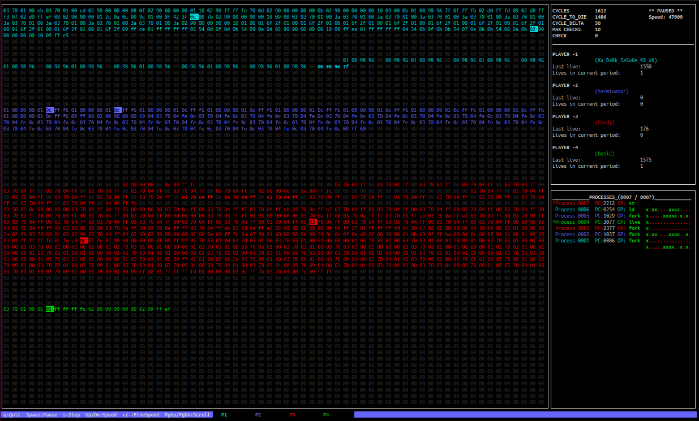
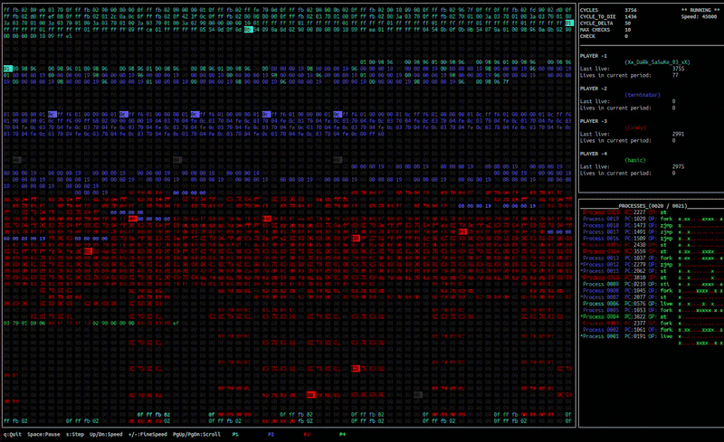

# Corewar — Rust

Traduction du projet Corewar (C) en Rust, avec visualiseur ncurses interactif et shell Web WASM. Workspace Cargo avec 5 crates :

<p align="center">
  
</p>

<p align="center">
  
</p>

| Crate | Rôle |
|-------|------|
| `corewar-common` | Constantes, types, op_table, utilitaires partagés |
| `corewar-asm` | Assembleur — traduit les fichiers `.s` en bytecode `.cor` |
| `corewar-vm` | Machine virtuelle — exécute les champions dans l'arène |
| `corewar-disasm` | Désassembleur — traduit les `.cor` en `.s` |
| `corewar-wasm` | Bridge WASM — compile la VM en WebAssembly pour le navigateur |

## Compilation

```bash
cargo build
```

Les binaires se trouvent dans `target/debug/` : `asm`, `corewar`, `disasm`.

## Utilisation

```bash
# Assembleur : .s → .cor
./target/debug/asm champs/zork.s

# Désassembleur : .cor → .s
./target/debug/disasm champs/zork.cor

# Machine virtuelle
./target/debug/corewar --dump 1000 champs/zork.cor champs/big_feet.cor
./target/debug/corewar -v champs/zork.cor champs/big_feet.cor

# Visualiseur ncurses interactif
./target/debug/corewar -n champs/zork.cor champs/big_feet.cor
```

---

## Visualiseur ncurses

Le flag `-n` lance le visualiseur ncurses interactif, inspiré de la version C mais avec des améliorations :

### Contrôles clavier

| Touche | Action |
|--------|--------|
| `Espace` | Pause / Reprendre |
| `s` | Step — avance d'**exactement 1 cycle** puis se met en pause |
| `↑` / `↓` | Vitesse (pas de 500) |
| `+` / `-` | Vitesse fine (pas de 100) |
| `PgUp` / `PgDn` | Scroller les processus |
| `q` | Quitter |

### Fonctionnalités

- **Arène 64×64** avec coloration par propriétaire et surbrillance des cellules récemment écrites (`scrb`)
- **Panneau latéral** : cycles, cycle_to_die, infos joueurs, liste des processus
- **Barre d'état** en bas : légende des contrôles et couleurs des joueurs
- **Mode step-by-step** (`s`) : avancer cycle par cycle pour le debugging
- **Scroll des processus** : quand il y a plus de processus que de lignes visibles, PgUp/PgDn permet de naviguer
- **Double buffering** : `wnoutrefresh()` + `doupdate()` pour un affichage sans scintillement

---

## Benchmark : C vs Rust

Comparaison des performances entre la version C (compilée avec `-O2`) et la version Rust (compilée en `--release`).

### Environnement de test

- **C** : GCC, compilé avec `-Wall -Wextra -Werror -O2`, binaire 231 Ko
- **Rust** : rustc 1.95, compilé en `--release` (optimisations LLVM), binaire 1.2 Mo
- **Test** : `corewar -dump N champs/` en mode texte (sans ncurses), temps mesuré avec `time`

### Résultats — Vitesse d'exécution

| Test | C (-O2) | Rust (release) | Rust × plus rapide |
|------|---------|----------------|-------------------|
| 2 champions / 10 000 cycles | 20 ms | 8 ms | **2.5×** |
| 2 champions / 50 000 cycles | 50 ms | 10 ms | **5.0×** |
| 2 champions / 100 000 cycles | 51 ms | 11 ms | **4.6×** |
| 4 champions / 10 000 cycles | 160 ms | 13 ms | **12.3×** |
| 4 champions / 100 000 cycles | 1 990 ms | 93 ms | **21×** |

### Résultats — Taille des binaires

| | C (-O2) | Rust (release) |
|--|---------|----------------|
| Taille | **231 Ko** | 1.2 Mo |

### Analyse : pourquoi le Rust est plus rapide ?

1. **`Vec<Process>` vs liste chaînée** — Le Rust stocke les processus dans un tableau contigu en mémoire, ce qui offre une excellente localité cache. Le C utilise des `t_list` avec `malloc` individuel par nœud, ce qui disperse les données en mémoire et cause des **cache misses** constants.

2. **Pas de `malloc`/`free` par fork/zombie** — Le C alloue et libère un nœud de liste chaînée pour chaque `fork` et chaque zombie tué. Le Rust utilise un `Vec` avec un allocateur d'arène qui recycle la mémoire, bien plus efficace.

3. **Optimisations LLVM** — Le compilateur Rust (backend LLVM) est plus agressif : inlining automatique, vectorisation SIMD, élimination de code mort. Même avec `-O2`, GCC sur cette base de code ne matche pas LLVM.

4. **`ft_printf` vs formatage Rust** — La version C utilise une réimplémentation personnalisée de `printf` (`ft_printf` du projet libft) qui est nettement plus lente que le formatage natif de Rust.

### Résumé comparatif

| Critère | C | Rust | Gagnant |
|---------|---|------|---------|
| Vitesse d'exécution | | | **Rust (5–21× plus rapide)** |
| Taille binaire | **231 Ko** | 1.2 Mo | **C (5× plus petit)** |
| Empreinte mémoire runtime | **Minimal** | Runtime Rust standard | **C** |
| Passage à l'échelle (scaling) | | | **Rust (performances stables avec plus de processus)** |

**Conclusion** : Pour la **performance brute**, le Rust écrase le C — surtout quand le nombre de processus augmente. Pour l'**empreinte mémoire minimale** (système embarqué), le C gagne. Pour Corewar sur une machine moderne, le Rust est le choix le plus performant.

---

## Protocole de test comparatif C vs Rust

### Prérequis — Compilation

```bash
# Terminal 1 — C
cd Corewar && make

# Terminal 2 — Rust
cd corewar-rust && cargo build
```

Vérifie que les binaires existent :

```bash
# C
ls -l ./corewar ./asm ./disasm

# Rust
ls -l ./target/debug/corewar ./target/debug/asm ./target/debug/disasm
```

---

### Test 1 — Assembleur : sortie binaire identique

Les deux assembleurs doivent produire des `.cor` **byte-à-byte identiques**.

```bash
# C
./asm champs/zork.s && md5sum champs/zork.cor

# Rust
./target/debug/asm champs/zork.s && md5sum champs/zork.cor
```

**Résultat attendu** : même hash MD5 = binaires identiques.

**Test en masse** (dans un seul terminal) :

```bash
# Assemble tout avec C
for f in champs/*.s; do ./asm "$f"; done
md5sum champs/*.cor > /tmp/c_asm.md5

# Assemble tout avec Rust
for f in champs/*.s; do ./target/debug/asm "$f"; done
md5sum champs/*.cor > /tmp/rust_asm.md5

# Compare
diff /tmp/c_asm.md5 /tmp/rust_asm.md5
```

**Si différence** : compare en détail un champion :

```bash
./asm champs/zork.s && cp champs/zork.cor /tmp/zork_c.cor
./target/debug/asm champs/zork.s && cp champs/zork.cor /tmp/zork_rust.cor
cmp -l /tmp/zork_c.cor /tmp/zork_rust.cor | head -20
```

---

### Test 2 — Désassembleur : sortie texte identique

```bash
# C (sort vers un fichier *-dis.s)
./disasm champs/zork.cor && cp champs/zork-dis.s /tmp/zork_c_dis.s

# Rust (sort aussi vers un fichier *-dis.s)
./target/debug/disasm champs/zork.cor && cp champs/zork-dis.s /tmp/zork_rust_dis.s

# Compare
diff /tmp/zork_c_dis.s /tmp/zork_rust_dis.s
```

**Résultat attendu** : aucune différence.

**Test en masse** :

```bash
# C
for f in champs/*.cor; do ./disasm "$f"; done
for f in champs/*-dis.s; do cp "$f" /tmp/c_$(basename "$f"); done

# Rust
for f in champs/*.cor; do ./target/debug/disasm "$f"; done
for f in champs/*-dis.s; do cp "$f" /tmp/rust_$(basename "$f"); done

# Compare
for f in /tmp/c_*-dis.s; do
    name=$(basename "$f")
    diff "$f" "/tmp/rust_$name" && echo "$name OK" || echo "$name DIFF"
done
```

---

### Test 3 — VM : Dump mémoire (LE TEST CLE)

C'est **le test le plus important** pour valider que la machine virtuelle exécute correctement. Les deux VM doivent produire une mémoire **identique** après N cycles.

#### Format de dump

Le C affiche en colonnes avec des offsets :
```
0x0000 : 0b 68 01 00 0f 00 01 06 64 01 00 00 00 00 01 01 00 00 00 01 09 ff fb 00 00 00 00 00 00 00 00 00
```

Le Rust affiche des lignes de 64 hex chars sans offsets :
```
0b6801000f00010664010000000001010000000109fffb000000000000000000
```

Il faut **normaliser** le format avant de comparer.

#### Script de comparaison de dump

Crée ce script `compare_dump.sh` à la racine du projet C :

```bash
#!/bin/bash
# Usage: ./compare_dump.sh <cycles> <champion1.cor> [champion2.cor] ...

CYCLES=$1
shift
CHAMPS="$@"

# Dump C -> extraire juste les hex, supprimer offsets et espaces
./corewar -dump $CYCLES $CHAMPS 2>/dev/null | \
    sed 's/.*: //' | tr -d ' \n' > /tmp/c_dump_${CYCLES}.hex

# Dump Rust -> concatener les lignes
./target/debug/corewar --dump $CYCLES $CHAMPS 2>/dev/null | \
    tr -d '\n' > /tmp/rust_dump_${CYCLES}.hex

# Comparer
if diff -q /tmp/c_dump_${CYCLES}.hex /tmp/rust_dump_${CYCLES}.hex > /dev/null 2>&1; then
    echo "OK - Dump identique a $CYCLES cycles"
else
    echo "ECHEC - DIFFERENCE a $CYCLES cycles !"
    # Trouver le premier octet different
    c_len=$(wc -c < /tmp/c_dump_${CYCLES}.hex)
    r_len=$(wc -c < /tmp/rust_dump_${CYCLES}.hex)
    echo "   C:    $c_len hex chars"
    echo "   Rust: $r_len hex chars"
    # Premier byte different
    cmp -l /tmp/c_dump_${CYCLES}.hex /tmp/rust_dump_${CYCLES}.hex | head -5
fi
```

```bash
chmod +x compare_dump.sh
```

#### Tests progressifs

Commence petit, puis augmente :

```bash
# 1 champion, cycle 0 (juste le chargement en memoire)
./compare_dump.sh 0 champs/zork.cor

# 1 champion, 100 cycles
./compare_dump.sh 100 champs/zork.cor

# 1 champion, 1000 cycles
./compare_dump.sh 1000 champs/zork.cor

# 2 champions, cycle 0 (chargement cote a cote)
./compare_dump.sh 0 champs/zork.cor champs/big_feet.cor

# 2 champions, 500 cycles (premieres instructions executees)
./compare_dump.sh 500 champs/zork.cor champs/big_feet.cor

# 2 champions, 5000 cycles (bataille en cours)
./compare_dump.sh 5000 champs/zork.cor champs/big_feet.cor

# 3+ champions
./compare_dump.sh 5000 champs/zork.cor champs/big_feet.cor champs/live.cor
```

**Pourquoi progressif ?** Si le dump differe a cycle 0, le probleme est dans le **chargement**. Si c'est OK a 0 mais pas a 100, c'est dans l'**execution des opcodes**. Si ca marche jusqu'a 5000, c'est probablement OK.

#### Test de non-regression automatisé

```bash
for cycles in 0 10 100 500 1000 2000 5000 10000; do
    ./compare_dump.sh $cycles champs/zork.cor champs/big_feet.cor
done
```

---

### Test 4 — VM : Verification du vainqueur

```bash
# C -- sans ncurses, avec verbosity
./corewar -v champs/zork.cor champs/big_feet.cor 2>&1 | tail -3

# Rust -- avec verbosity
./target/debug/corewar -v champs/zork.cor champs/big_feet.cor 2>&1 | tail -3
```

**Resultat attendu** : meme joueur declare gagnant.

---

### Test 5 — Roundtrip complet

Verifie que asm -> disasm -> asm donne le meme binaire :

```bash
# Rust uniquement
./target/debug/asm champs/zork.s
cp champs/zork.cor /tmp/zork_rt1.cor

./target/debug/disasm champs/zork.cor
./target/debug/asm champs/zork-dis.s
cp champs/zork-dis.cor /tmp/zork_rt2.cor

diff /tmp/zork_rt1.cor /tmp/zork_rt2.cor && echo "Roundtrip OK" || echo "Roundtrip casse"
```

---

### Recapitulatif des commandes rapides

| Ce que tu testes | Commande |
|---|---|
| Assembleur 1 fichier | `./asm champs/zork.s && md5sum champs/zork.cor` vs `./target/debug/asm champs/zork.s && md5sum champs/zork.cor` |
| Assembleur en masse | `diff <(for f in champs/*.s; do ./asm "$f"; done; md5sum champs/*.cor) <(for f in champs/*.s; do ./target/debug/asm "$f"; done; md5sum champs/*.cor)` |
| Desassembleur | `diff <(./disasm champs/zork.cor > /dev/null; cat champs/zork-dis.s) <(./target/debug/disasm champs/zork.cor > /dev/null; cat champs/zork-dis.s)` |
| VM dump | `./compare_dump.sh 1000 champs/zork.cor champs/big_feet.cor` |
| Vainqueur | Comparer la sortie `-v` des deux VM |

---

## Bugs corriges lors de la traduction

| Bug | Fichier | Description |
|-----|---------|-------------|
| Header .cor +2 octets | `codegen.rs` | `PROG_NAME_LENGTH+1` et `COMMENT_LENGTH+1` au lieu de `PROG_NAME_LENGTH` et `COMMENT_LENGTH` |
| Desassembleur tronque | `types.rs` | `Header::from_bytes` lisait 129 octets pour le nom au lieu de 128 |
| header_size() faux | `types.rs` | Retournait 2194 au lieu de 2192 (4+128+4+4+2048+4) |
| +3 offset hallucination | `vm.rs` | `op_sti` et `op_st` avaient un `+3` errone sur les adresses de stockage |
| kill_zombies O(N^2) | `vm.rs` | `Vec::remove(i)` dans une boucle remplace par `retain_mut` en O(N) |
| Lexer sans espace | `lexer.rs` | `fork%:label` non reconnu car `%` n'etait pas un delimiteur d'opcode |
| Code mort | `parser.rs`, `error.rs`, `lexer.rs` | Champ `mem_pos` et variantes `Syntax`/`Other` inutilises supprimes |

---

## Shell Web — WASM (WebAssembly)

La page `docs/shell.html` offre un shell Corewar complet dans le navigateur, utilisant la **vraie VM Rust compilée en WebAssembly**. Cela signifie que le code qui exécute les champions dans le navigateur est **exactement le même** que le binaire CLI — il n'y a aucune réimplémentation JavaScript de la logique de la VM. Le WASM s'exécute entièrement côté client (dans le navigateur), il n'y a pas de backend ni de serveur.

### Pourquoi WASM et pas JavaScript ?

Une réimplémentation JavaScript de la VM Corewar serait :
- **Incorrecte par nature** : les bugs de traduction seraient inévitables (arithmétique modulo, gestion des carry, encodage des opcodes, etc.)
- **Inutile comme référence** : le but du projet est de fournir une implémentation de référence fiable pour aider d'autres à corriger leur projet
- **Impossible à maintenir** : chaque modification du code Rust devrait être répliquée manuellement en JS

En compilant la VM Rust en WASM, on obtient :
- **Zéro réimplémentation** : le code est le même que le CLI, compilé vers une cible différente
- **Fidélité garantie** : si le CLI produit un dump correct, le shell Web aussi
- **Maintenance automatique** : toute modification du code Rust se répercute automatiquement dans le shell Web à la prochaine compilation WASM

### Architecture de `corewar-wasm`

Le crate `corewar-wasm` est un bridge mince qui enveloppe la VM Rust avec `wasm-bindgen` pour l'exposer au JavaScript du navigateur. Il ne contient **aucune logique de VM** — il se contente de traduire les types Rust en types JS et d'exposer les méthodes nécessaires.

```
┌─────────────────────────────────────────────────────────┐
│                    Navigateur                            │
│                                                          │
│  shell.html (JS)                                        │
│  ┌──────────────────┐  ┌──────────────────────────┐     │
│  │  UI : terminal    │  │  UI : canvas arène       │     │
│  │  (xterm.js)       │  │  (visualisation 64×64)   │     │
│  └────────┬─────────┘  └────────────┬─────────────┘     │
│           │                         │                    │
│           └──────────┬──────────────┘                    │
│                      │ appels WASM                       │
│                      ▼                                   │
│  ┌──────────────────────────────────────────────┐       │
│  │  corewar-wasm (WasmVm)                       │       │
│  │  ─────────────────────────                   │       │
│  │  load_player_bytes() → charge un .cor        │       │
│  │  init()              → place les champions   │       │
│  │  step() / step_n()   → exécute N cycles      │       │
│  │  get_arena()         → mémoire 4096 octets    │       │
│  │  get_owner()         → carte des propriétaires│       │
│  │  get_scrb()          → buffer d'écriture      │       │
│  │  drain_events_json() → événements (live, aff) │       │
│  └──────────────────┬───────────────────────────┘       │
│                     │ utilise                             │
│  ┌──────────────────▼───────────────────────────┐       │
│  │  corewar-vm (Vm, Player, Process, VmEvent)   │       │
│  │  ────────────────────────────────────         │       │
│  │  LE MÊME CODE QUE LE BINAIRE CLI             │       │
│  └──────────────────────────────────────────────┘       │
└─────────────────────────────────────────────────────────┘
```

### Feature gating du visualiseur ncurses

La VM Rust utilise normalement ncurses (via `pancurses`) pour le visualiseur interactif. Or ncurses ne peut pas se compiler en WASM — c'est une bibliothèque système C qui nécessite un terminal. Pour résoudre ce problème, le visualiseur est **feature-gated** dans `corewar-vm` :

```toml
# corewar-vm/Cargo.toml
[features]
default = ["visualizer"]
visualizer = ["ncurse-dep"]

[dependencies]
ncurse-dep = { package = "ncurses", version = "5.101", optional = true }
```

Quand `corewar-wasm` dépend de `corewar-vm`, il **désactive les features par défaut** :

```toml
# corewar-wasm/Cargo.toml
[dependencies]
corewar-vm = { path = "../corewar-vm", default-features = false }
```

Ainsi, la compilation WASM n'inclut ni ncurses ni le module `visualizer` — uniquement le cœur de la VM. Le module `visualizer` est conditionné par `#[cfg(feature = "visualizer")]` dans `lib.rs` et `main.rs`, ce qui signifie qu'il est totalement exclu de la compilation WASM.

### Système d'événements (`VmEvent`)

En mode CLI, la VM affiche les événements via `println!` (live, aff, vainqueur). En mode WASM, il n'y a pas de stdout — le navigateur ne peut pas lire les prints Rust. Pour résoudre ce problème, la VM collecte les événements dans un `Vec<VmEvent>` :

```rust
pub enum VmEvent {
    PlayerAlive { nplayer: i32, name: String, cycle: i32 },
    AffChar { ch: char },
    Winner { nplayer: i32, name: String },
}
```

Les méthodes `player_alive()` et `op_aff()` poussent des événements dans `self.events` au lieu de faire un `println!`. Le bridge WASM expose `drain_events_json()` qui vide le buffer et renvoie les événements au format JSON, que le JavaScript peut alors parser et afficher dans le terminal xterm.js.

Cette approche est propre et ne modifie pas le comportement de la VM : en mode CLI, les événements sont simplement imprimés ; en mode WASM, ils sont collectés et transmis au frontend.

### Méthodes exposées par `WasmVm`

Le bridge WASM expose les méthodes suivantes au JavaScript :

| Méthode | Description |
|---------|-------------|
| `WasmVm.new()` | Crée une nouvelle instance de la VM |
| `load_player_bytes(data, name)` | Charge un champion depuis les bytes d'un fichier `.cor` |
| `load_player_bytes_with_num(data, name, n)` | Charge un champion avec un numéro de joueur spécifique |
| `init()` | Place les champions dans l'arène et crée les processus initiaux |
| `step()` | Exécute exactement 1 cycle, renvoie `false` si la VM est terminée |
| `step_n(n)` | Exécute N cycles d'un coup |
| `reset()` | Réinitialise la VM (conserve les champions chargés) |
| `get_arena()` | Renvoie une copie de l'arène (4096 octets) |
| `get_owner()` | Renvoie la carte des propriétaires (4096 octets : 0=aucun, 1-4=joueur) |
| `get_scrb()` | Renvoie le screen buffer (cellules récemment écrites) |
| `drain_events_json()` | Vide et renvoie les événements en JSON |
| `cycles()` | Cycle actuel |
| `cycle_to_die()` | Valeur actuelle de CYCLE_TO_DIE |
| `process_count()` | Nombre de processus vivants |
| `player_count()` | Nombre de joueurs |
| `is_running()` | La VM est-elle en cours d'exécution |
| `player_name(idx)` | Nom du joueur à l'index donné |
| `player_nplayer(idx)` | Numéro du joueur |
| `player_lives(idx)` | Nombre de lives du joueur |
| `process_pc(idx)` | PC du processus à l'index donné |
| `process_owner(idx)` | Propriétaire du processus |
| `process_ir(idx)` | Instruction register du processus (-1 si aucune) |
| `process_op_name(idx)` | Nom de l'opcode en cours d'exécution |
| `winner_nplayer()` | Numéro du vainqueur |
| `winner_name()` | Nom du vainqueur |
| `set_verbose(v)` | Active/désactive le mode verbeux |

Plus des fonctions utilitaires : `mem_size()`, `cycle_to_die_init()`, `cycle_delta()`, `nbr_live()`, `max_checks()`, `reg_number()`, `op_name(opcode)`, `op_cycle(opcode)`.

### Compilation WASM locale

Pour compiler le WASM localement (par exemple pour tester le shell sans push sur GitHub) :

```bash
# Prérequis : installer wasm-pack
curl https://rustwasm.github.io/wasm-pack/installer/init.sh -sSf | sh

# Ajouter la cible WASM au toolchain Rust
rustup target add wasm32-unknown-unknown

# Compiler (depuis la racine du workspace)
cd corewar-wasm
wasm-pack build --target web --out-dir ../../docs/wasm -- --no-default-features
```

Le flag `--no-default-features` est crucial : il désactive la feature `visualizer` de `corewar-vm`, sinon la compilation échouerait car ncurses ne peut pas être compilé en WASM.

Le résultat est placé dans `docs/wasm/` :
- `corewar_wasm.js` — le glue code JavaScript généré par wasm-bindgen
- `corewar_wasm_bg.wasm` — le binaire WebAssembly compilé

Le fichier `shell.html` importe ces fichiers via `import init, { WasmVm } from './wasm/corewar_wasm.js'`.

---

### GitHub Actions : workflow de build et déploiement

Le projet utilise GitHub Actions pour compiler le WASM et déployer le shell sur GitHub Pages automatiquement à chaque push sur `main`. Le workflow est défini dans `.github/workflows/pages.yml`.

#### Pipeline CI/CD

```
Push sur main
     │
     ▼
┌─────────────────────┐
│  Job: build          │
│  ─────────────       │
│  1. Checkout du repo │
│  2. Install Rust     │
│     (target: wasm32) │
│  3. Install wasm-pack│
│  4. Build WASM       │
│     cd Corewar-rust/ │
│     corewar-wasm/    │
│     wasm-pack build  │
│     --target web     │
│     --out-dir        │
│     ../../docs/wasm  │
│  5. Verify output    │
│     (test -f .js     │
│      test -f .wasm)  │
│  6. Upload artifact  │
│     (docs/)          │
└─────────┬───────────┘
          │
          ▼
┌─────────────────────┐
│  Job: deploy         │
│  ─────────────       │
│  1. Download artifact│
│  2. Deploy to        │
│     GitHub Pages     │
└─────────────────────┘
```

#### Détails du workflow `pages.yml`

```yaml
name: Build WASM and Deploy

on:
  push:
    branches: [main]
  workflow_dispatch:          # Permet aussi de lancer manuellement

permissions:
  contents: read
  pages: write
  id-token: write             # Requis pour le déploiement GitHub Pages

concurrency:
  group: "pages"
  cancel-in-progress: true    # Annule les builds en cours si un nouveau push arrive

jobs:
  build:
    runs-on: ubuntu-latest
    steps:
      - name: Checkout
        uses: actions/checkout@v4

      - name: Install Rust
        uses: dtolnay/rust-toolchain@stable
        with:
          targets: wasm32-unknown-unknown    # Cible WASM

      - name: Install wasm-pack
        run: curl https://rustwasm.github.io/wasm-pack/installer/init.sh -sSf | sh

      - name: Build WASM
        run: |
          cd Corewar-rust/corewar-wasm
          wasm-pack build --target web --out-dir ../../docs/wasm -- --no-default-features

      - name: Verify WASM output
        run: |
          ls -la docs/wasm/
          test -f docs/wasm/corewar_wasm.js || (echo "Missing JS glue" && exit 1)
          test -f docs/wasm/corewar_wasm_bg.wasm || (echo "Missing WASM binary" && exit 1)

      - name: Upload artifact
        uses: actions/upload-pages-artifact@v3
        with:
          path: docs

  deploy:
    needs: build
    runs-on: ubuntu-latest
    environment:
      name: github-pages
    steps:
      - name: Deploy to GitHub Pages
        id: deployment
        uses: actions/deploy-pages@v4
```

#### Points clés du workflow

1. **`targets: wasm32-unknown-unknown`** — Indique à rustup d'installer la cible WASM. Sans ça, la compilation échouerait avec "can't find crate for std".

2. **`--no-default-features`** — Désactive la feature `visualizer` (ncurses) de `corewar-vm`. C'est indispensable car ncurses est une dépendance système C qui ne peut pas être cross-compilée vers WASM.

3. **`--target web`** — Dit à wasm-pack de générer un format compatible avec les imports ES modules (utilisable directement avec `import` dans le navigateur, sans bundler comme Webpack).

4. **`--out-dir ../../docs/wasm`** — Place les fichiers générés dans le dossier `docs/wasm/` qui est servi par GitHub Pages. Le `shell.html` les importe avec `from './wasm/corewar_wasm.js'`.

5. **Vérification des outputs** — Le workflow vérifie que les fichiers `.js` et `.wasm` existent bien avant de déployer. Si la compilation Rust échoue silencieusement ou produit un output incomplet, le workflow échoue au lieu de déployer une version cassée.

6. **`workflow_dispatch`** — Permet de lancer le build manuellement depuis l'onglet Actions sur GitHub, utile pour forcer un redéploiement sans faire de commit.

7. **Concurrency** — Si plusieurs pushes arrivent rapidement, seul le dernier build se termine, les autres sont annulés pour éviter de gaspiller des minutes CI.

#### Dépannage du workflow

Si le workflow échoue, les causes les plus probables sont :

| Erreur | Cause | Solution |
|--------|-------|----------|
| `can't find crate for std` | Cible WASM non installée | Vérifier que `targets: wasm32-unknown-unknown` est dans le step Rust |
| `linking with cc failed` | ncurses inclus dans le build WASM | Vérifier le `--no-default-features` dans la commande wasm-pack |
| `Missing JS glue` / `Missing WASM binary` | La compilation a échoué silencieusement | Regarder les logs du step "Build WASM" pour l'erreur Rust |
| `403` au déploiement | Permissions insuffisantes | Vérifier que le repo a GitHub Pages activé et que le workflow a les permissions `pages: write` |
| Le shell affiche "Module WASM non chargé" | Les fichiers WASM ne sont pas dans `docs/wasm/` | Vérifier que le workflow a bien produit les fichiers et que GitHub Pages sert bien le dossier `docs` |

---

### Fonctionnalités du shell Web

Le shell offre une interface complète dans le navigateur :

- **Terminal interactif** (xterm.js) — Commandes : `load`, `sample`, `asm`, `asmload`, `run`, `step`, `pause`, `reset`, `status`, `arena`, `dump`, `players`, `procs`, `speed`, `help`
- **Visualisation de l'arène** (canvas) — Grille 64×64 en hexadécimal, colorée par propriétaire, avec surbrillance des cellules récemment écrites (scrb) et des compteurs de programme (PC)
- **Mode agrandi** — L'arène prend les 3/4 de la page, le terminal est réduit
- **Mode plein écran** — L'arène occupe tout l'écran avec contrôles intégrés et panneau d'info latéral
- **Éditeur d'assembleur** — Écrire du code `.s` directement dans le navigateur, l'assembler et le charger dans la VM
- **Chargement de fichiers** — Charger des fichiers `.cor` depuis le disque local
- **Champions exemples** — `live`, `zork`, `forker`, `stimp` pré-intégrés
- **Contrôle de vitesse** — Slider de 1 à 100, adaptatif pour les simulations longues

### Assembleur JavaScript

Le shell inclut un assembleur JavaScript autonome pour le code `.s` écrit dans l'éditeur. Cet assembleur n'est **pas** une réimplémentation de `corewar-asm` — il est utilisé uniquement pour le workflow interactif dans le navigateur (écrire du code → assembler → charger dans la VM). Pour les besoins de référence et de validation, l'assembleur Rust (`corewar-asm`) doit être utilisé en CLI. L'assembleur JS génère un fichier `.cor` complet avec le header correct (magic number, nom, commentaire, taille du programme, bytecode), compatible avec la VM Rust.
